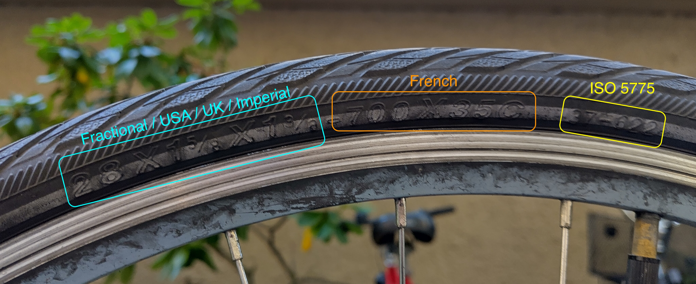

# Bike Tire Sizing

Need to replace a tyre? This is how tire sizing works.

Bike Sizing is defined in 3 different forms:

- The [ISO 5775](https://en.wikipedia.org/wiki/ISO_5775) standard.
- The Fractional / USA / UK / Imperial system.
- The French system.

## ISO 5775

Formatted as two numbers with a dash, e.g. `37-622` (as pictured above)

- The first number the width of the tyre in millimetres.
- The second number is the inner diameter of the tyre in millimetres.

_I recommend using this standard._

## French

Formatted as a number, an 'x', a number and a letter, e.g. `700 x 35C` (as pictured above).

- The first number is the outer diameter of the tyre in millimetres.
- The second number is the width of the tyre in millimetres.
- The letter signifies the designation for bicycle rims, see the table below.

| Letter | Designation type rims  |
|--------|------------------------|
| SS     | Straight-side          |
| TSS    | Tubeless straight-side |
| C      | Crochet                |
| HB     | Hooked-bead            |
| (none) | Tubeless crochet       |

The 'x' is just an 'x'.

## Fractional / USA / UK / Imperial

Formatted as a number, an 'x', a number, an 'x', and a number, e.g. `28 x 1 5⁄8 x 1 3⁄8` (as pictured above).

- The first number is the outer diameter of the tyre in inches.
- The second number is the depth of the tyre, in inches (and fractions of an inch)
- The third number is the width of the tyre, in inches (and fractions of an inch)

The 'x' are just 'x's.

## Sources

- [ISO_5775 on Wikipedia](https://en.wikipedia.org/wiki/ISO_5775)
- [Guide to bike tyre sizes - I Love Bicycling](https://ilovebicycling.com/a-guide-to-bike-tire-sizes/)
- [Sheldon Brown's Tyre sizing](https://www.sheldonbrown.com/tire-sizing.html)

## Why post this?

I needed to replace a tyre, and it took me a little while to find the information I needed.

Hope this helps someone else!

~ Matt Smith / Harmelodic
