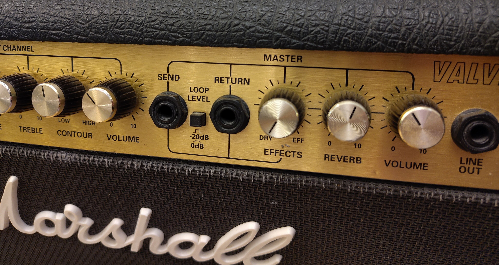

# Pedals & Pedalboards

This is a bit of a work in progress... just so you know.

Guitar pedalboards are boards with pedals on them that provide functionality to a guitarist.

Most pedals are "effects pedals", which will change the sound of the guitar that is plugged into the pedal board. Some
pedals provide other functionality, like tuning or providing effects for other things that could be available to a
guitarist (e.g. a microphone).

For more about what other things (other than pedals) affect the sound of the guitar, I recommend watching
[Jim Lill's "Tested" videos on YouTube](https://www.youtube.com/@JimLill/videos).

## The Signal Chain

A pedalboard is effectively a *chain* of pedals. A guitar (which produces the signal when playing) is plugged into the
first pedal, which performs some signal processing, before passing the signal to the next pedal, and so on. The last
pedal outputs a signal that goes into a guitar amp, that will amplify the sound so it can be heard by audiences.

Different pedals provide different effects, and so the order of the pedals in the signal chain can change how the sound
finally appears. Whilst guitars can desire a deliberately uncomfortable tone, it's typically beneficial to stick to a
specific order, to ensure the tone of the guitar sound is actually pleasing.

A good order would be:

- Guitar
- [Tuning](#tuning)
	- Before everything to get the raw guitar tone to maximise tuning accuracy.
- [Dynamics](#dynamics)
	- Before all effects to level out the sound ready for further signal processing.
- [Pitch](#pitch-effects) (change the pitch of the signal).
	- After Dynamics, because we want to cleanly pitch shift a levelled signal, not the raw signal.
	- Before all other effects, so pitch shifting can be cleanly achieved.
- [Gain](#gain-effects) (to adjust gain and/or dirty the signal).
	- After Dynamics + Pitch, because Dynamics + Pitch pedals need a clean signal to work best.
	- Before Modulations, because Gain pedals aren't just about distortion but about increasing loudness in the
	  desired way _before_ modulation effects, since we'll also get loudness after modulations from the amp.
- [Modulations](#modulation-effects) (actual "effects" that make the signal sound cool / weird).
	- After Gain, to receive the signal with the amount of gain desired before modulation effects.
	- Before Time-based, so that time-based effects don't screw with the modulation effects or signal quality.
- [Time-based Modulations](#time-based-modulation-effects) (effects that mess with signal timing).
	- After other Modulations, since time-effects can do weird things to signals that make other modulations sound weird
	  if done before.
- Amp input
- Amp speaker sound

### Amp effects loop option

An amp may provide boost option as well as modulation and delay effects.

Based on the order described above, it would be beneficial to insert these effects into the correct points of the signal
chain. For this reason, some amps offer the ability to send the signal through an "effects loop" before it returns to
the amp for amplification. Amp that do this provide two jack sockets to "send" and "return" the signal.

{ width="400" }
/// caption
A send/return effects loop on a "Marshall Valvestate 80V" amp
///

This results in an order:

- Guitar
- [Tuning](#tuning)
- [Dynamics](#dynamics)
- [Pitch](#pitch-effects)
- [Gain](#gain-effects)
- Amp input
- Amp Gain effects
- Amp "Send"
- [Modulations](#modulation-effects)
- [Time-based Modulations](#time-based-modulation-effects)
- Amp "Return"
- Amp speaker sound

## Pedals

TODO: Expand more on different pedal types and how they work.

### Tuning

Pedals that help you tune your instrument by reading the signal.

- LED / Cent
- Strobe
- Accuracy (+/- cent)
- Mute on switch / pass through
- Useful to have a [buffer](#buffers) here on this, since it's often at the beginning of the signal chain.

### Dynamics

Dynamics == Pedals that "dynamically" affect the volume (amplitude) of the signal.

So: compression pedals. Makes the loud bits quieter and the quiet bits louder to "even out" the volume of the different
parts of the signal, before we go mess with it later in the signal chain.

Compression pedals can have a couple of different controls:

- Threshold (or Sustain, Sensitivity, or just "compression"): Measured in decibels (dB) and it's the amount of volume
  that is required before the compressor starts to compress the audio.
- Attack: Measured in milliseconds, this is how quickly the compressor will start doing compression after it receives a
  burst of signal.
- Release: Measured in milliseconds, this is how quickly the compressor will stop compressing the audio after
  compression is no longer needed.
- Compression Ratio: A ratio of how much compression to perform (1:1 = no compression, 2:1 = some, 4:1 = more, etc.)
- Volume / Makeup Gain: A extra boost in volume, in case the compressor is compressing as intended but the signal is now
  a little too quiet.

### Pitch effects

Pedals that affect the pitch of the sound by modulating the frequency of the signal.

- Pitch-shifting (re-pitching the guitar sound (e.g. drop-tuning))

### Gain effects

Pedals that statically affect volume (amplitude) of the signal

Can also take a clean signal and make it "dirty" (add distortion, overdrive, crunch).

- Gain / Boost (increases gain / volume of a signal)
- Fuzz (changes the sound to be more of a distorted "fuzzy" tone).
- Overdrive (increases the gain so that it "soft-clips" to create a distorted tone).
- Distortion (increases the gain so that it "hard-clips" to create a heavily distorted tone).
- EQ / Equalizer (adjusts the volume of different frequencies of the signal)

### Modulation effects

Pedals that modulate (change the frequency or amplitude of the signal) to make the sound weird and/or cool.

- Tremolo (fluctuates volume)
- Vibrato (fluctuates pitch)
- Wah-wah (modifies the signal to make it sound like a voice going "wah" as you press it).

### Time-based modulation effects

Pedals that modulate (change the frequency or amplitude of the signal) in ways that use time as a factor.

- Delay / Echo (Plays the note and repeats it on a delay, and the note slowly fades away)
- Reverb (Makes the signal sound like it's being played in a large echoey hall)
- Chorus (Makes the guitar sound like multiple guitars by modifying pitch and delay (can sound a bit "seasick"))
- Phaser
	- Duplicates and modulates the signal with a "filter" and then mixes it back in with the original signal.
	- This puts these two signals "out of phase" with one another.
	- The output is a signal that is missing or altered in a way that sounds similar to Chorus, but different enough to
	  warrant its own effect.
- Flanger
	- Duplicates the signal, delays the duplicated signal and then mixes it back in with the original signal.
	- The output is a signal that is affected in a similar to a Chorus or Phaser, but is different enough to warrant its
	  own effect.
- Uni-Vibe
  - A pedal intended to emulate the rotating "Doppler sound" of a Leslie speaker.
  - Is kind of like a phaser, chorus and vibrato put together.

Good video on modulation effects [here](https://www.youtube.com/watch?v=UcMeNREszFg).

## Buffers

Buffers are features of pedals that ensures the pedal takes in a high impedance signal and outputs a low impedance
signal. This is done in an effort to retain signal quality.

It is generally recommended to put a buffer at least at the _start_ and _end_ of your pedalboard ensures your signal
strength is maintained between your guitar and your amp, and the clarity of the signal (the notes and tone) are
minimally affected by the added impedance of the pedals.

### Quick science lesson on impedance

Electromagnets produce a magnetic field from an electric current, and changes to the current changes the magnetic field.
Variable reluctance sensors (VR sensors) are the opposite: Creating an electric current from a changes in a magnetic
field.

Guitar pickups are VR sensors. The magnet in the pickup magnetises the string. Plucking the string changes the magnetic
field which produces an electric current. Since the plucking of a string is a _wave_ it produces an alternating
current (and therefore also an alternating voltage). The frequency of this alternating electric signal corresponds to
the frequency of the note (The "A" above middle C = 440 Hz).

Impedance is a measurement of "opposition to alternating current flow" and can be calculated as:

> Impedance = Voltage / Current  
> where we measure the values of an alternating Voltage and Current at the "peaks" of the signal wave.

Therefore, you can perceive impedance in two ways when it comes to electric guitar audio signals:

1. The measurable _**output**_ impedance of any device that produces an electric audio signal (e.g. a guitar or pedal
   output).
2. The measurable _**input**_ impedance of any device that receives an electric audio signal (e.g. a pedal input or amp
   input).

In order for an input device to receive and handle a signal from an output, the impedance needs to match. We as
guitarists / sound engineers don't need to do this, as "physics" does this for us by having the input of a device reduce
the Voltage or Current amplitude of the signal, to ensure the impedance matches. This is important for handling audio
for two reasons:

1. Different signal frequencies have different measurable impedances (because the ratio between Voltage and Current is
   different at different frequencies, because "physics").
2. Audio processing gear produce sound based on the _Voltage_ frequency & amplitude of the signal, not the Current.

This has the nasty effect that if a high impedance signal is fed into a low impedance signal, then for some frequencies
the Voltage amplitude will be reduced, which affects the quality of the signal.

In order to retain signal quality, we want to always reduce Current amplitude rather than Voltage, so the audio gear can
receive the full amplitude signal. In order to ensure this for all frequencies, we need to ensure that output signals
have a much lower impedance than the input of the device that will receive the signal.

A buffer is a feature of a pedal that ensures that the input has a high impedance but the signal is boosted to have a
low impedance when it is output of the pedal.

## Power & Power Supplies

Pedals require power in order to function, which typically comes from a power supply dedicated for powering the pedals
(as opposed to powering them directly from mains power).

Powering pedals from mains power, or through a crappy dedicated power supply, or via daisy-chained power cables, can
introduce an unpleasant hum to the pedals and effect signal quality, because the power electrical connection is "
dirty" (i.e. it carries with it a lot of noise, like distortions, surges, etc.). A good quality power supply can provide
each pedal with dedicated power that is "clean" - thus preventing noise from entering the signal chain.

Power supplies can supply different amounts of power for pedals that need power. In electricity,
`Power = Current x Voltage`. Most power supplies provide power for different voltages and currents for different pedals
that need different amounts of voltage or current. When connecting a pedal to a power supply, the voltages _must_ match,
and the current of the power supply needs to be greater than or equal to the current needed by the pedal. Some power
supplies can output configurable amounts of voltage and current - meaning you can buy basically any pedal and then just
flick a switch or two on the power supply to ensure the right voltage and current is supplied to the pedal.

Most pedals I've noticed require 9 V and different amounts of current, though usually often under 100 mA. Some pedals
require much more current though, like my programmable EQ which requires 9 V and 200 mA of current. Other pedals
require more voltage, like the [BOSS CP-1X Compressor](https://www.boss.info/us/products/cp-1x/) which requires 18 V and
90 mA of current.

Before buying a power supply, I recommend you spreadsheeting what pedals you are likely to have (or already have and
want to power), and see:

- How many power outputs you need.
- What voltages you need.
- What amount of current you need.

and then buy a power supply that is appropriate for your setup. If you want more variability, then buy a configurable
power supply, like the [Cioks DC7](https://cioks.com/power-supplies/future-power-generation/cioks-dc7/).

## Sources

As well as just my own experience / knowledge, I also used a bunch of sources to put this page together:

- [How to set up a guitar pedalboard (pedalplayers.com)](https://pedalplayers.com/how-to-set-up-a-guitar-pedalboard/)
- [Dynamics and Gain (humbuckersoup.com)](https://humbuckersoup.com/dynamics-and-gain/)
- [What do guitar pedals actually do? (guitarspace.org)](https://guitarspace.org/guitar-accessories/what-does-guitar-pedal-do/)
- [Types of Guitar Pedals (guitarlobby.com)](https://www.guitarlobby.com/types-of-guitar-pedals/)
- [Time-Based pedal (effects-pedals.info)](https://www.effects-pedals.info/c/time-based/)
- [A Crash Course on Buffers (premierguitar.com)](https://www.premierguitar.com/pro-advice/tone-tips/guitar-pedal-buffer)
- [Champion Legacy: Understanding Guitar Signals](https://championleccy.com/2017/02/02/clever-stuff-1-guitar-signals/)
- [Champion Legacy: Understanding Impedance](https://championleccy.com/2017/02/02/clever-stuff-2-get-outta-my-way-impedance/)
- [Wikipedia: Pickup](https://en.wikipedia.org/wiki/Pickup_(music_technology))
- [Wikipedia: Impedance](https://en.wikipedia.org/wiki/Electrical_impedance)
- [Understanding buffers (jhspedals.info)](https://jhspedals.info/pages/understanding-buffers)
- [High vs Low impedance - How it affects guitar tone (pedalplayers.com)](https://pedalplayers.com/high-vs-low-impedance-how-it-affects-guitar-tone/)
- [A better explanation of impedance for Audio signals](https://www.youtube.com/watch?v=TjC1Zbm4xpc)
- [A guitarists guide to compression](https://www.premierguitar.com/pro-advice/state-of-the-stomp/a-guitarists-guide-to-compression)
- [How Do Compressor Pedals Work?](https://www.youtube.com/watch?v=LUXR8UnYhzc)

