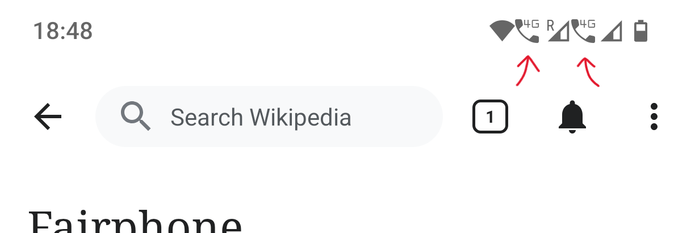
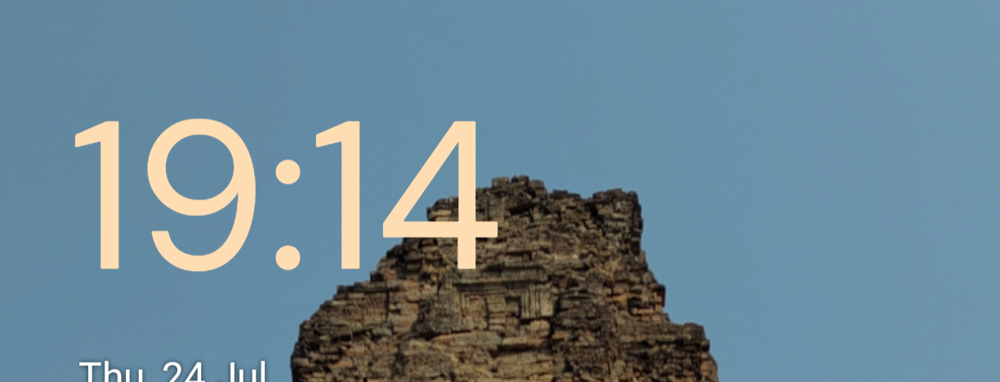
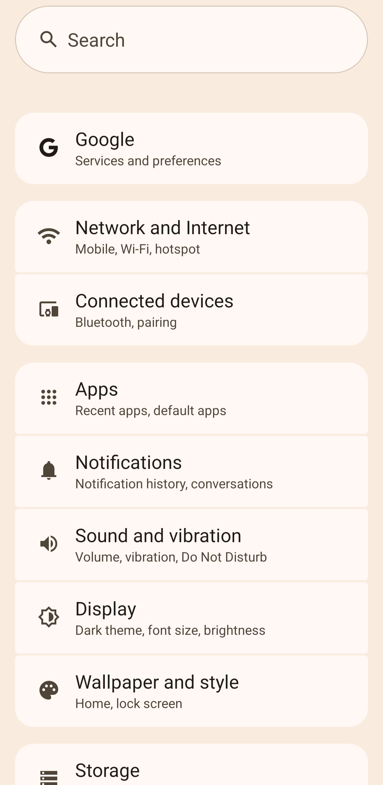
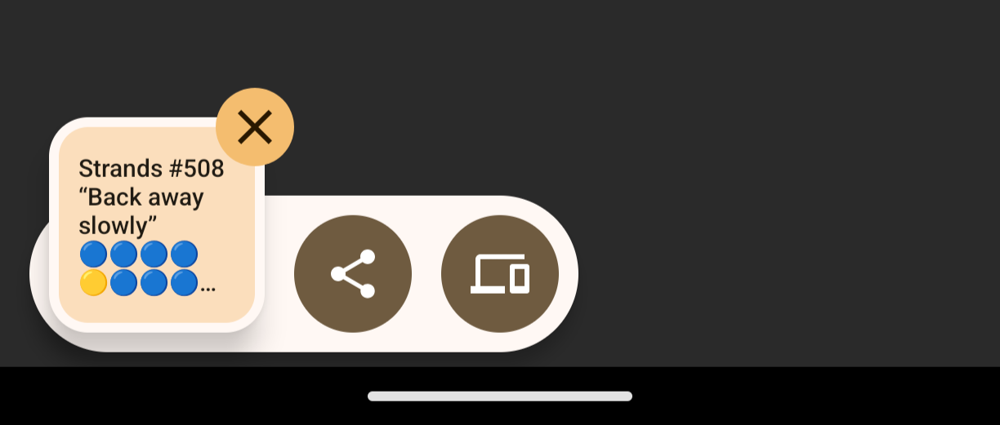

# Fairphone 5 Review Update - Android 15

After the [Android 14 upgrade](./fairphone-5-review-update-android-14.md), and a bunch of security patches, another
update for Fairphone OS update has come to the Fairphone 5 (my phone): Android 15.

As far as I can tell, it's extremely similar to Android 14, with a few added features and UI tweaks.

## Release Note

The release note that came with this upgrade on my phone.

This is
also [documented on Fairphone's Support website](https://support.fairphone.com/hc/en-us/articles/18682800465169-Fairphone-5-Release-Notes).

> **VT28.C.042**
>
> **Android 15**
>
> The Fairphone 5 is getting an upgrade to Android 15! This update brings enhanced security and privacy features to
> protect you and your device, along with some other improvements.
>
> **Private Space**
>
> Create a separate private space of with an additional layer of authentication to keep sensitive apps, like social,
> dating or banking apps, away from prying eyes.
>
> **Passkeys integration**
>
> Passkeys was first introduced by Google in Android 14 and is now available on Fairphone, including the recent updates
> as part of Android 15 which supports one-tap sign in.
>
> **Theft Protection**
>
> Theft Protection is a hub for proactive security features and tips that help keep your devices and data more secure by
> deterring theft and providing quick recovery in the event of a stolen device.
>
> **Small Quality of Life Improvements**
>
> - New 4x5 grid option for home screen
> - Option to increase contrast
> - Disable sending device name Wi-Fi
> - Partial Screen Recording
> - Interactive control center Bluetooth panel
> - App Archiving
> - Set your default wallet app
> - You can now remove the search bar from your homescreen to get additional space to place icons.
>
> **Other improvements**
>
> Security path level: 5th of June 2025

## Reflections

Cool! Security and privacy updates are (nearly) always good!

I care very little about Private Space... or do I? 👀 (no).

Weird about Passkeys and Theft Protection as I was already using Passkeys on Android 14 and I think I'd seen Theft
Protection already turned on in Android 14... so, maybe there were some minor updates to those features?

Quality of Life Improvements? Neat.

But what about those UI changes that I mentioned above? Well, here's a list of the UI changes that I've noticed.

### Phone 4G system icons

I have two SIMs in my phone, this means I get system icons in the top left that show the strength of the mobile signal
available for each network (the little triangles), along with some letters (like `R` for Roaming, or `5G` for 5G).

The difference now? I also have two small system icons next to each mobile signal icon, with a phone and the letters
`4G`. I suspected that these icons indicate that I have [VoLTE](https://en.wikipedia.org/wiki/Voice_over_LTE) enabled
for those SIMs, and it is using 4G to do that, and sure enough, if I disable VoLTE for one of those SIMs, the icons
disappear.

{ width="300" }
/// caption
Phone 4G System Icons
///

I would like to have VoLTE enabled, but I'd also like to choose not to have the system icons showing. Does Fairphone
OS / Android 15 have that option? No, it does not - and there isn't a Developer option that I could find that would turn
them off either. So... that's a little annoying.

### Bottom sheets restyling

Bottom sheets are the term for the little mini pop-ups that occasionally appear at the bottom of the screen, prompting
you to do some action (e.g. biometric / fingerprint verification). These have been slightly restyled to have bigger
icons and much more severely rounded corners.

It's difficult to get an uncensored screenshot of these bottom sheets so... no picture of this and you'll just have to
trust me in saying that: It looks a bit naff, when compared in my head to how Android 14 bottom sheets looked.

### Lock Screen Time

The time on the lock screen is now a little less bold than it was before. Wow. Innovation.

{ width="300" }
/// caption
The Time on the Lock Screen
///

### Settings restyled

The Settings app / menu has been restyled and looks more like items on a page, rather than text sitting on a blank page.
It's a little less "abstract" / "minimalist" of a design choice, and oddly inconsistent as the inner settings menus are
still the same minimalist text-on-page style as before with no borders.

Even more odd, the settings menu is now _less_ responsive. When I tap on one of the menus to enter into that section,
there's a little pause before it actually opens that menu (I noticed this as well a while ago when Apple redesigned
their macOS Settings app (in 2024? 2023?) - which makes me think either the big tech giants are both really stupidly
rebuilding their Settings apps to be worse, or this is an intentional design choice, ... or it's just coincidence).

{ width="300" }
/// caption
New Settings Menu
///

### Clipboard and Screenshot buttons restyling

Before Android 15 (not sure when it was introduced), whenever you took a screenshot or copied text to the clipboard,
there is a little preview of the screenshot/copied text that appears with a few buttons for some quick actions to take.
These buttons are shown on
this [How-To Geek article](https://www.howtogeek.com/741319/how-to-take-a-scrolling-screenshot-on-android/).

The difference now? The buttons in those menus aren't rounded squares, but are either (a) text buttons with completely
rounded corners, or (b) icon buttons and circular. Even more innovation.

{ width="300" }
/// caption
Screenshot Quick Menu
///

{ width="300" }
/// caption
Clipboard Quick Menu
///

### New Quick Share icon

Oh, and notice that little icon in the Clipboard Quick Menu, that looks like a laptop and a phone?

That's the new Quick Share menu icon - allowing you to "quickly share" things with other devices - changed from the
old "two-arrows point at each other in a circle" one from before.

---

That's all.

Hope you're having a nice day ~ Harmelodic / Matt Smith