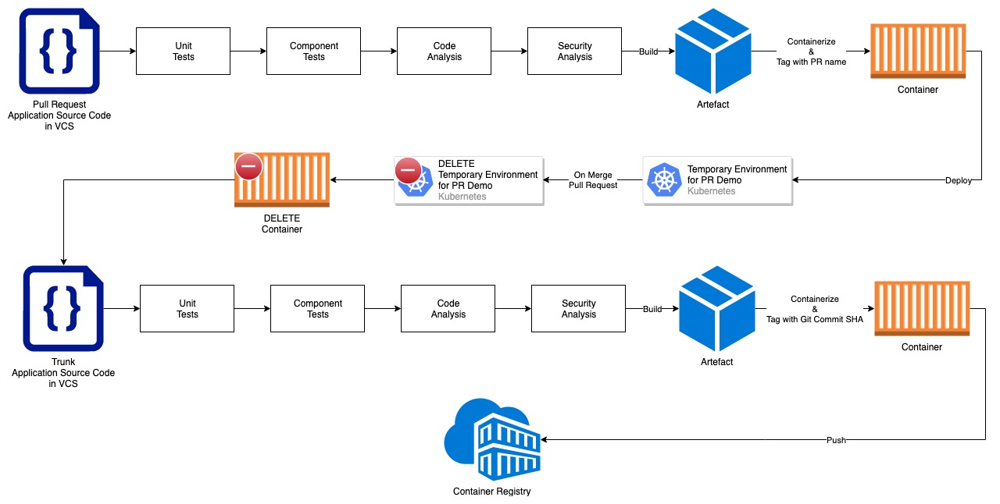
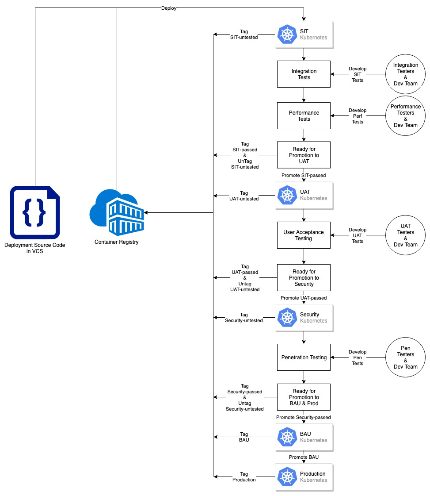
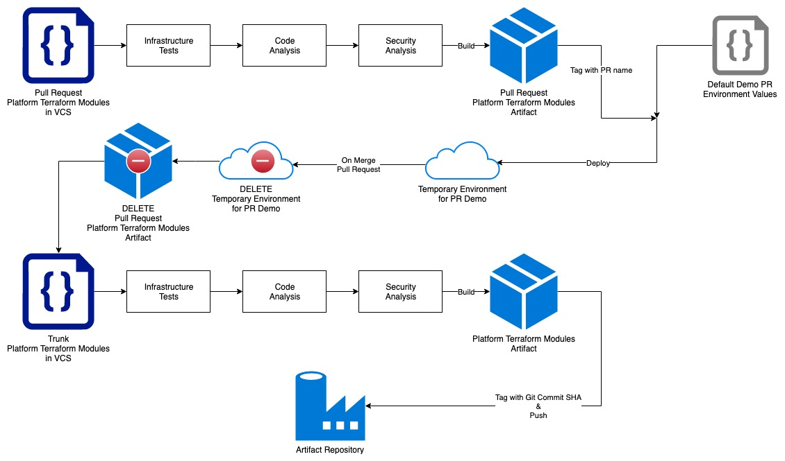
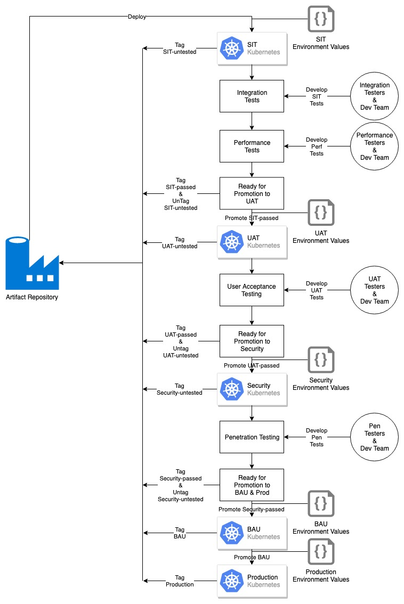

# Building and Deploying projects like a Pro (old)

> Originally published: 30 June 2019

## Not applicable any more

The world has moved on, and I have learned more and I don't really recommend many of what I put in this any more, at
all.

Some is still relevant, but maybe some time in the future I'll write a post about what I think now... or not. I don't
know if you want to hear about it: let me know.

---

## Original post

A while ago, I wrote [a blog about my ideal CI/CD pipeline](an-ideal-ci-cd-pipeline-old.md).

This post builds on that CI/CD pipeline post by going through the overarching Build and Deployment process of an ideal
project.  
Again, like with that post, this is an _ideal_ process. I am not dictating: "_Implement this or die_", but I am
saying: "_I heavily recommend implementing this, or at the very least, getting as close as possible to implementing
this, within your context_".

## Precursors

### DevOps

You should be doing DevOps in your project team. I could go into this now, but I'll save that for another blog post.

Basically what I mean by this is you should be managing your application development (the Dev) as well as your
infrastructure & CI/CD pipelines (Ops) all in your project team.

### Serverless

If you're doing things Serverless, there really isn't much to do when it comes to managing your infrastructure (hence it
being called "Serverless") so only the Dev part really applies to you Serverless people.

### Development Practices

Do the following:

- [Agile](https://en.wikipedia.org/wiki/Agile_software_development) (and not
  the [bad kind](https://www.youtube.com/watch?v=dgvERPrujJ0))
- [TDD](https://en.wikipedia.org/wiki/Test-driven_development)
- [Trunk Based Development](https://trunkbaseddevelopment.com/)

### Containerization

You should be using Containers by now.  
When it comes to managing Containers, [Kubernetes](https://kubernetes.io/) is leading the industry, so I recommend using
that too.

### Automation

You should be automating everything, wherever possible.

For Dev automation: Write your application & tests, use a build tool (Maven, npm, etc.), and execute in CI/CD
pipelines.  
For Ops automation: Implement [GitOps](https://www.weave.works/blog/gitops-operations-by-pull-request), using tools like
Terraform and Ansible, and execute in CI/CD pipelines.

## Dev Build

## Dev Deployment & Promotion

## Ops Build

## Ops Deployment & Promotion

